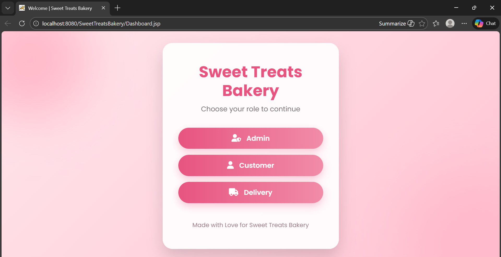

# 🎂 Online Cake Bakery Management System

> A full-stack Java-based bakery management system that streamlines online cake ordering, customer management, order processing, and delivery management.


---

# 📌 Project Overview

The **Online Cake Bakery Management System** is a web-based application developed to automate bakery operations and improve customer experience.

The system allows customers to browse cakes, place online orders, and manage their accounts while providing administrators with powerful tools to manage cakes, customers, orders, and delivery personnel.

This project was developed as part of a Software Engineering academic project and demonstrates practical implementation of database-driven web applications using Java and MySQL.

---

# ✨ Features

## Customer Module

- Customer Registration
- Secure Login
- Browse Available Cakes
- View Cake Details
- Place Orders
- Order Management

## Admin Module

- Secure Admin Login
- Add New Cakes
- Update Cake Information
- Delete Cakes
- Manage Customers
- Manage Orders
- Assign Delivery Personnel

## Delivery Module

- Delivery Personnel Login
- View Assigned Deliveries
- Update Delivery Status

---

# 🛠 Technologies Used

| Technology | Purpose |
|------------|----------|
| Java | Backend Development |
| HTML5 | Frontend Structure |
| CSS3 | User Interface Styling |
| MySQL | Database |
| Apache NetBeans IDE | Development Environment |
| JDBC | Database Connectivity |

---

# 🗄 Database

The project uses **MySQL** as its relational database.

Main Tables include:

- Admin
- Customers
- Cakes
- Orders
- Delivery Persons
- Deliveries

The SQL database file is included in this repository.

---

# 📂 Project Structure

```
Online-Cake-Bakery-Management
│
├── src/
├── web/
├── nbproject/
├── database/
│     bakery.sql
│
├── screenshots/
│
├── SC&DReport12.docx
│
├── README.md
│
└── .gitignore
```

---

# 🚀 How to Run

## Clone Repository

```bash
git clone https://github.com/Zunaira-Noor123/Online-Cake-Bakery-Management.git
```

## Import into NetBeans

- Open Apache NetBeans
- Open Existing Project
- Select the project folder

## Configure Database

- Open MySQL Workbench
- Create a database
- Import `bakery.sql`
- Update database username and password in the connection class if required

## Run the Project

- Build the project
- Start the server
- Launch the application

---

# 📸 Application Screenshots

### Home Page



---

### Cake Details


---


# 📈 Learning Outcomes

This project strengthened my understanding of:

- Object-Oriented Programming (Java)
- Database Design
- CRUD Operations
- JDBC Connectivity
- Frontend Development
- Software Engineering Principles
- MVC Concepts
- Version Control using Git & GitHub

---

# 🔮 Future Improvements

- Online Payment Integration
- Email Notifications
- OTP Verification
- Responsive Mobile Interface
- Analytics Dashboard
- Inventory Management
- Customer Reviews & Ratings

---

# 👩‍💻 Developer

**Zunaira Noor**

Software Engineering Student

---

# ⭐ Support

If you found this project useful, consider giving it a ⭐ on GitHub.


